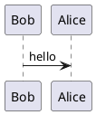

<!-- @import "../less/common.less" -->

# Markdown

VSCodeによるMarkdown編集のメモです。

[toc]

## 設定

### settings.json

```json
{
    "markdown-preview-enhanced.automaticallyShowPreviewOfMarkdownBeingEdited": true,
    "markdown-preview-enhanced.breakOnSingleNewLine": true,
    "markdownlint.config": {
        "MD025": {
            "front_matter_title": ""
        },
        "MD024": {
            "siblings_only": true
        },
    },
    "pasteImage.path": "${currentFileDir}/image",
    "editor.fontFamily": "monospace, monospace",
    "editor.codeActionsOnSave": {
        "source.fixAll": true,
    },
}
```

## PlantUMLを使う

### Markdown Preview Enhanced

VSCodeのExtensionsからインストールする。

### Graphvizのインストール

下記ページからダウンロードしてインストールする。
[Graphvivダウンロード](http://www.graphviz.org/download/)

### 使用例



