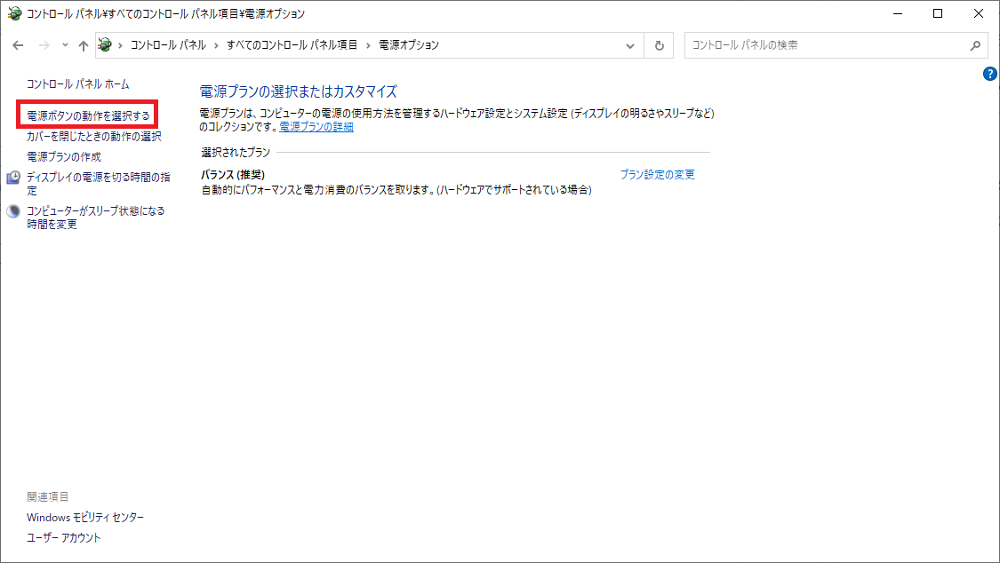
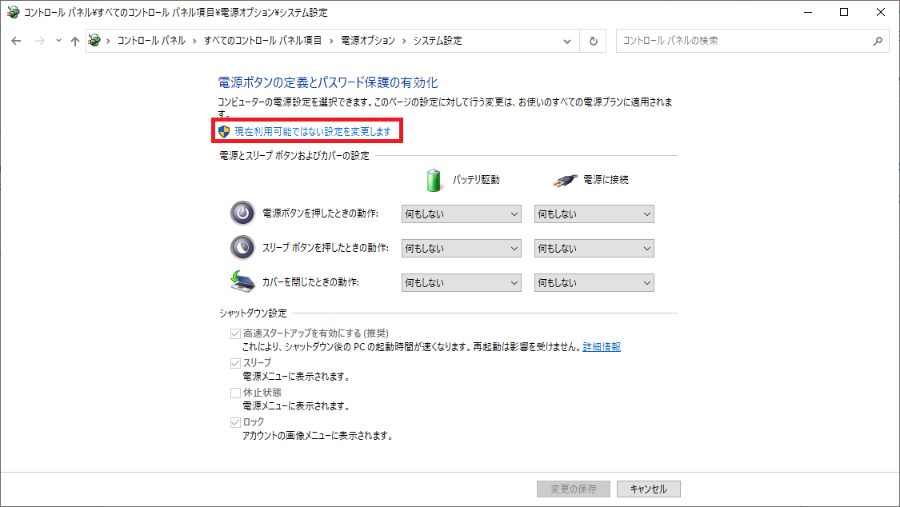

<!-- @import "../less/common.less" -->

# Windows

Windowsに関するメモ。

## 完全シャットダウン

参考：<https://jp.ext.hp.com/techdevice/windows10sc/60/>

### 常時完全シャットダウンにする方法

1. 「コントロールパネル」→「電源オプション」を開き、「電源ボタンの動作を選択する」をクリックする。
   

2. 「現在利用可能ではない設定を変更します」をクリックする。
   

3. 「高速スタートアップを有効にする(推奨)」のチェックを外す。
   

4. 「変更の保存」をクリックする。
